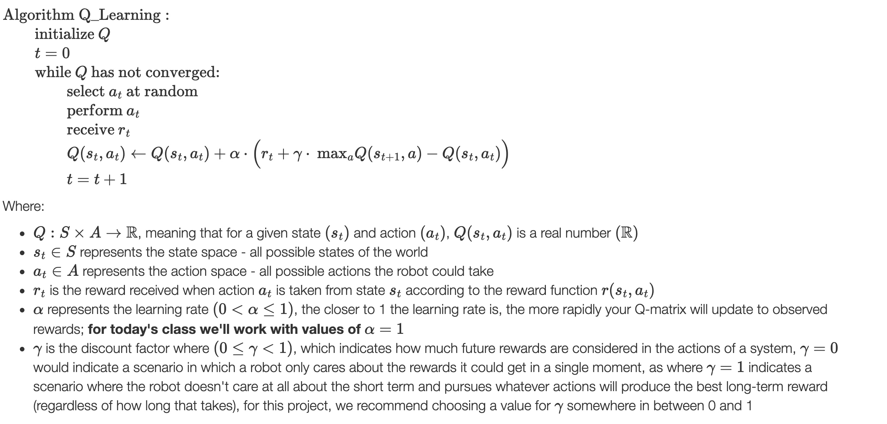

# q_learning_project

## Implementation Plan

### Names of team members
Jingyu Cai [jcai23@uchicago.edu](mailto:jcai23@uchicago.edu)

Zhou Xing [zhouxing@uchicago.edu](mailto:zhouxing@uchicago.edu)

### Component implementation and testing
- **Q-learning algorithm**
    - **Executing the Q-learning algorithm**
   
     Follow the Q-learning algorithm below, and test it by comparing some manual calculation results with printed results from code.
        

    - **Determining when the Q-matrix has converged**
    
      Set a threshold value (e.g. `epsilon = 0.01`) so that if the sum of variation of all entries in the matrix is less than `epsilon`, we would denote this matrix as "unchanged" from the previous state. If such "static" status keeps for a certain number of loop (e.g. 5 loops), we would determine this matrix as converged. We would test it by printing out the matrix once it reaches the static status, and manually check it's consistent with the optimal trajectory.

    - **Once the Q-matrix has converged, how to determine which actions the robot should take to maximize expected reward**

      For each state, take the action with the highest Q-value. Similar to taking a greedy strategy following the Q matrix. The testing would be the same as the one in the previous section: print out the converged matrix, and check if the strategy it indicates is identical to one of the optimal solutions.

- **Robot perception**
    - **Determining the identities and locations of the three colored dumbbells**
  
        The idea would be using **Sensory-Motor Control**, and following the *Line Follower* class exercise from Class 3: 
        
        For each color of the three dumbbells:
        1. Defining the range for pixels in this color in the image feed to determine the identities of the dumbbells
        2. After getting locations of all pixels in this color, compute the center of the "color block", and turn the head of robot to put it at the center of the camera.
        
        For testing, we would look at the GUI of Gazebo, and see if the robot would turn to the wanted dumbbell. 

    - **Determining the identities and locations of the three numbered blocks**
  
        We would navigate to the front of these three numbered blocks (so that the number would be at the center of the camera), and use `keras_ocr` for digit recognition by implementing the pre-trained models into our script. After determining their identities, we would also determine the locations of the blocks using the robot's odometry and LiDAR data. For testing, once a number is recognized, we would print out this number and check if it's consistent with the one shown on Gazebo.

- **Robot manipulation & movement**
    - **Picking up and putting down the dumbbells with the OpenMANIPULATOR arm**

        Following the *Forward & Inverse Kinematics* section in class 8, we would calculate the desired angle for each joint, based on the size of the dumbbells. The putting down process is expected to be the reverse of the picking up process. For testing, it would also simply be a "visual check" on Gazebo to see if the robot can lift and put down the dumbbells.

    - **Navigating to the appropriate locations to pick up and put down the dumbbells**
  
        We would implement proportional control to enable the robot to navigate to the dumbbell of a particular color. It would be similar to the *Person Follower* in warm-up project. For testing, we would also look at Gazebo to check if the robot moves to the wanted dumbbell.

### Timeline (tentative)
- Robot perception: May 3rd
- Robot manipulation and movement: May 7th
- Q-learning: May 10th
- The rest of the time would be used for tuning and optimization.
- DDL: Wednesday, May 12 11:00am CST

### Testing Steps
#### Q Learning
	$ roscore
	$ roslaunch q_learning_project training.launch
#### Robot Perception & Movement
	$ roscore
	$ roslaunch q_learning_project action.launch
	
	
## Writeup

**Please see the code from the master branch!**

### Demo GIF (10x speed up)

### Objectives description
For this project, the objective is to first train a Q-matrix based on the Q-learning algorithm. Then, with the trained Q-matrix that specifices what action to take in a particular state to maximize the received reward, we need to make the robot perform a sequence of perceptions and movements to place each dumbbell in front of the correct block.

### High-level description
To determine which dumbbell belongs in front of which block, we used reinforcement learning by employing the Q-learning algorithm. The robot can be in different states (defined by where the dumbbells are) and different actions that it can take in each state (defined by the movement of a dumbbell to a block), and each action in a given state results in a reward. Specifically, we used the pre-defined `actions.txt`, `states.txt`, and `action_matrix.txt` to define a set of functions that finds the best action to take in a given state that maximizes the received reward, resulting in a Q-matrix. Once the Q-matrix is trained, we will be able to choose an action from each state and apply that onto the movement of the robot in Gazebo.

### Q-learning algorithm description
The relevant code are located in `q_learning.py`.

- **Selecting and executing actions for the robot (or phantom robot) to take**: For this component, we first initialized an empty Q-matrix populated with 0s and published that to the `QMatrix()` message, and set the current state to 0. Then, for each given state, we chose a random and valid action for the robot to take (move a dumbbell to a block) from the pre-defined files that elicit possible actions and states in the `action_states` folder, and published that action as a `RobotMoveDBToBlock()` message to the robot/phantom robot. Lastly, after processing the received reward, we would jump into the next state and repeat the above process.
	- `init()`: In here, we set up the necessary variables for selecting and executing actions for the robot/phantom robot, including the publishers for `QMatrix()` and `RobotMoveDBToBlock()`, the action matrix, actions, and states from the pre-defined files, and variables to keep track of the robot's state. We also initialized the Q-matrix and published it, and chose a random action to begin.
	- `initialize_q_matrix()`: In here, we assigned every cell within the Q-matrix with a value of 0 to start.
	- `select_random_action()`: In here, we identified the valid actions to take given a current state from `self.action_matrix`, and randomly selected one of those actions using numpy's `choice()` function. Then, after updating what the next state would be for the selected action, we published the dumbbell color and block number via a `RobotMoveDBToBlock()` message for the robot/phantom robot to execute.
- **Updating the Q-matrix**: For this component, we mainly employed the Q-learning algorithm we discussed in class. 
	- `update_q_matrix()`: In here, we used the Q-learning algorithm to update the Q-matrix given a particular state and action, and is called in `reward_received()` whenever there is a reward callback.
- **Determining when to stop iterating through the Q-learning algorithm**: To test convergence, we defined a threshold value and tested if the Q-value changes remain below the threshold for a given number of iterations. If the number of static iterations are reached, then we stop iterating and save the Q-matrix as a csv file.
	- `update_q_matrix()`: After each update, we checked if the Q-value change is above or below the defined `self.epsilon` from `init()`. If it is below, we increase our count of the `self.static_tracker`. Otherwise, we set the tracker value back to 0.
	- `is_converged()`: This checks if the number of static iterations meet `self.static_iter_threshold`.
	- `reward_received()`: This integrates the above functions to check if the Q-matrix has converged after every reward callback, and saves the matrix if it has converged or keep taking random actions if otherwise.
- **Executing the path most likely to lead to receiving a reward after the Q-matrix has converged on the simulated Turtlebot3 robot**: For each state, we will take the action with the highest Q-value in the converged Q-matrix for the robot to execute. Note that for this component, the code is instead located in `robot_action.py`.
	- `get_action_sequence()`: After loading the converged `q_matrix.csv`, we will iterate through each state, beginning with 0 (when everything is at the origin) and choose the largest Q-value as the action to take. We will append each action onto the `self.action_sequence` array containing elements of tuples in the form of `(db, block)`.
	- `run()`: This function iterates through the `self.action_sequence` array for the robot to execute the actions from perception and movement integrations.

### Robot perception description
The relevant code are located in `robot_action.py`.

- **Identifying the locations and identities of each of the colored dumbbells**: We took inspiration from the *Yellow Line Follower* exercise in class 3 to complete this component.
	- `move_to_dumbbell()`: We use a hard-coded upper bound and lower bound of each color, use this range to construct a filter, and apply it on the hsv file converted from the camera image. If there's any pixels within the range of the desired color, we compute the center of these pixels, and rotate the robot so that the center would be at the center of the camera. Once we have the color center, which is the position of the desired dumbbell, right in front of the robot, we use laser scan to gauge the distance between the robot and the dumbbell. Specifically, we use an ratio term `(w/2 - cx) / w` to determine if the color center is right in front of the robot. If this ratio is less than `0.05`, we then would set a very small range of euler angle (`[-10, 10]`) for the laser, and take the minimum distance of this angle range as the distance between robot and the dumbbell.
- **Identifying the locations and identities of each of the numbered blocks**: We used LiDAR data to determine the locations as well as the `keras_ocr` pipeline to recognize the digits on the blocks.
	- `process_scan()`: We first use laser scan to determine the `self.large_angle` between blocks before any action has happened with the help from `compute_large_angle()`. This is to approximate how much the robot has to turn from facing one block to facing the next one (in our case, the block on the left), which will be useful for block perception and movement.
	- `move_to_block()`: When looking for the correct block, we first use the color mask to check if there's any black pixels in the view. If not, continue with a small counterclockwise rotation. If the robot finds black pixels, we used `keras_ocr.pipeline.Pipeline().recognize()` to get `prediction_group`, which is a list of predicted patterns and the rectangle coordinates around them. We only look at the pattern in `prediction_group` with the smallest center of x coordinates using `is_correct_num()`, which is also the left most pattern in the view. If this pattern does not match the desired block id, the robot rotates by `self.large_angle`, and the robot will be facing to another block *completely*. If this pattern matches the desired block id, we filtered all black pixels in the view, and take the center of them, and rotate the robot so that the center will be in right front of the robot. Similar to the previous part, we use a ratio and a threshold to determine this. Once we have the "black center" in front of the robot, we use laser scan to gauge the distance.

### Robot manipulation and movement ###
The relevant code are located in `robot_action.py`.

- **Moving to the right spot in order to pick up a dumbbell**: This component is tightly integrated with perception so the robot can always keep track of the right spot of the dumbbell.
	- `move_to_dumbbell()`: For rotation, we used an error term `err = w/2 - cx` (`cx` is the x coordinate of the pixel center) and applied sensory control to set the angular speed.  Once the err ratio `ratio = err / w < 0.05`, we determine that the center is already in front of the robot. To move forwards, we used the laser scan data to determine the distance. Specifically, we take the minimum distance within `[-10, 10]` euler degree range and denote it as `min_dist`, and use sensory control again to set the linear speed. Once `min_dist < __goal_dist_in_front_db`, we stop the robot immediately.
- **Picking up the dumbbell**: The arms-and-gripper group has two state: *initial_pose* is with the arm leaning forward, gripper wide open, and *lifting_pose* is with the arm rising up, gripper tightly closed. 
	- `initialize_move_group()`: We set the robot to *initial_pose* at the start so the robot can smoothly lock onto the dumbbells.
	- `lift_dumbbell()`: We tuned the `self.__goal_dist_in_front_db` so that when the robot stops by the dumbbell, it just needs to switch to *lifting_pose*. Once the dumbbell is lifted up, the robot would move back for a deterministic distance (`self.pub_vel(0, -0.5), rospy.sleep(0.8)`), so that when it rotates, it won't be bumping into other dumbbells.
- **Moving to the desired destination (numbered block) with the dumbbell**: This component is tightly integrated with perception so the robot can always keep track of the right spot of the block.
	- `move_to_block()`: Following the perception part of the block, once we get the correct pattern from the camera, we would move to the center of black pixels in the view. The idea is nearly identical to `move_to_db`: use the `err` term to set angular speed and rotate so that the center of the black pixels is in front of the robot, but with some linear speed. Then use laser scan to get the `min_dist`, and apply sensory control to set the linear speed. Once the `min_dist < __goal_dist_in_front_block`, we stop the robot. Since we are turning by a `self.large_angle` to make sure that there's only one block in the center of the view, all black pixels should successfully average and lead the robot to the correct block. But there could be case that in the view we are seeing *two* sides of the cube, so we might be moving toward the *edge* of the block but not the right front of the block. To solve this problem, we hard-coded some angular bias by tuning the `k_p` value so that the robot can move closer to the block's front side.
- **Putting the dumbbell back down at the desired destination**: We set the arms-and-gripper group back to the *initial_pose* so the dumbbell can be placed on the ground.
	- `drop_dumbbell()`: Once the robot reaches the correct block, it puts down the arm and release the gripper to put the dumbbell. The robot also stepped back to avoid hitting the dumbbell when rotating. (Note that we use a class property `self.robot_status` to ensure the action sequence, i.e. `GO_TO_DB -> REACHED_DB -> PICKED_UP_DB -> MOVING_TO_BLOCK -> REACHED_BLOCK`. But while running with `action.launch`, we notice that the `reset_world` function would be triggered if the dumbbell is close enough to the block, *though not dropped yet*. Hence we're getting error for incorrect `self.robot_status` after `reset_world`, but it seems acceptable according to @Sarah Sebo.) 

### Challenges
Most of the challenges come from *identifying the correct block and moving to it*, since there are lots of cases to consider, also the `self.pipeline.recognize()` takes 3-5s for each execution, which makes it hard to synchronize the robot action, and prediction result. We avoided calling `self.pipeline.recognize()` repeatedly by 1. Implementing the `self.large_angle` so that we only deal with the "one-block" case; 2. Once found the correct block, we used black pixels, instead of the rectangles of predicted patterns, to guide the robot to the block; and hence we don't need to predict images at this stage. During testing, we also found that the dumbbell could be knocked to the ground when the robot picked it up or dropped it down. To tackle this, we open the gripper wider when it's about to lift the dumbbell, and also when the robot release the dumbbell at the correct block, we let it sleep for 0.5s, and then step back with a slower speed. 

### Future work
Since we are using black pixels to guide the robot to the block, sometimes the robot may detect more than one block face in its field, so it cannot move perfectly to the front of the center of the cube. We will try improve this part by utilizing the rectangles of predicted patterns in combination with LiDAR data to determine which face is the front and which face is sideways, so we will always move to the front of the block. We also noticed that sometimes the robot overshoots when trying to recognize the correct block. For example, when its goal is the center block, it might turn to an angle with the leftmost block in the view as well. In this case, the robot would miss the correct block, and keep turning. Though in our testing, when such overshoot happens, the robot is able to arrived at the correct block later on after turning an additional 360 degree. We are still interested in improving the accuracy for block detection, probably by fine-tuning the turning angles.

### Takeaways
- Launch file is a great tool to simplify executions. This projects involves multiple py files and launch files, and it became much easier to run after gathering them in one single launch file.
- This project requires you to think about the big picture while executing small components, so it may be helpful to not only think about implementing individual aspects but also how those aspects integrate. The Q-learning process determines the robot's actions, and perception and movement also go hand-in-hand, so having a clear picture of how the dots connect is really important.
